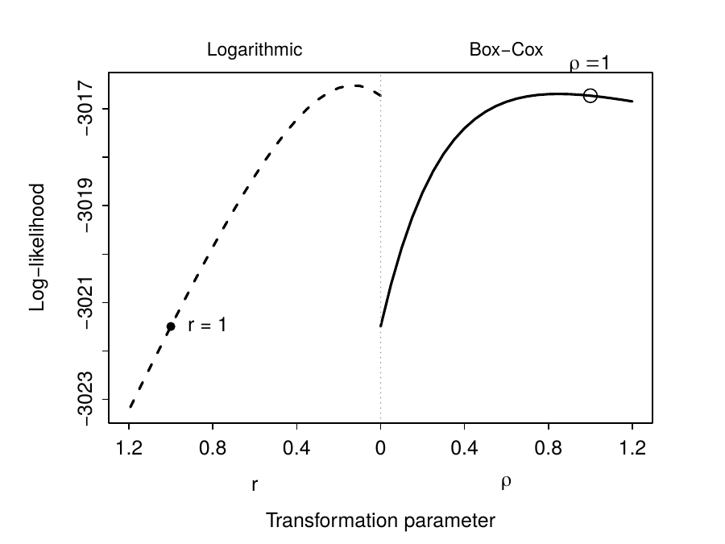

```{r setup, include = FALSE}
knitr::opts_chunk$set(
  collapse  = TRUE,
  comment   = "#>",
  fig.width = 6,
  fig.height = 4.5
)
```

## Overview

The `wnpmle` package provides regression modeling for the marginal mean
intensity of recurrent events in the presence of a competing terminal event
for two large classes of semiparametric transformation models. The marginal
mean intensity has a one-to-one correspondence with the marginal mean.
Covariate effects are therefore directly interpretable with regard to the
expected number of recurrences. Estimation is based on the weighted
nonparametric maximum likelihood estimator (wNPMLE) by Bellach and Kosorok
(2026), which extends the weighted NPMLE for competing risks (Bellach et al.,
2019), and model selection is facilitated by the profile log-likelihood and
the AIC.

Subjects who experience the terminal event remain in a pseudo-risk set, akin
to a cure fraction, and their unobserved censoring times are accounted for by
inverse probability of censoring weighting (IPCW). This approach facilitates
consistent and direct prediction of the marginal mean. In contrast, other
approaches remove terminal events from the risk set akin to censorings. This
methodology leads to modeling the marginal mean conditional on survival,
which is a biased estimate for the marginal mean.

| Models | Link function G(x) | Special cases |
|-------|---------------------|---------------|
| Box-Cox transformation models (`model = "boxcox"`) | $((1 + x)^\rho - 1)/\rho$ | Ghosh–Lin ($\rho = 1$); $\log(1+x)$ as $\rho \to 0$ |
| Logarithmic transformation models (`model = "log"`) | $\log(1 + r x)/r$ | Proportional odds ($r = 1$); Ghosh–Lin as $r \to 0$ |

Both are estimated via automatic differentiation using TMB, which provides
exact gradients and fast convergence.

---

## Installation

```{r, eval = FALSE}
install.packages("wnpmle")
```

Or from GitHub:

```{r, eval = FALSE}
# install.packages("remotes")
remotes::install_github("abellach/wnpmle")
```

---

## Quick start: bladder cancer data

The bladder cancer data from the Veterans Administration Cooperative
Urological Research Group were previously analyzed by Ghosh and Lin (2002)
and by Zeng and Lin (2006).
`bladder_prep()` prepares the 86 patients treated with thiotepa or placebo
from `survival::bladder1`, with treatment, the number of tumors and the size
of the largest tumor at baseline as covariates. The Box-Cox model with
$\rho = 1$, i.e. the identity link $G(x) = x$, is the Ghosh–Lin model, which
is a special case of the weighted NPMLE (Bellach and Kosorok, 2026).

```{r quick}
library(wnpmle)

bdata <- bladder_prep()
fit_bladder <- wnpmle_fit(
  Surv(time, status) ~ treat + num + size,
  data  = bdata,
  id    = "id",
  model = "boxcox",
  rho   = 1,
  tau   = 59
)
fit_bladder
```

---

## Example: hospital readmissions after colorectal cancer surgery

The readmission data (Gonzalez et al., 2005) contain repeated hospital
readmissions of 403 patients after surgery for colorectal cancer, with death
as competing terminal event. `readmission_prep()` returns one row per
readmission (status 1) and one final row per patient, either death
(status 2) or censoring (status 0). Time is measured in days since surgery.

```{r readmission-data}
rdata <- readmission_prep(tau = 1460)
head(rdata)
table(rdata$status)
```

The covariates are chemotherapy, sex, Dukes' tumor stage and the Charlson
comorbidity index. For our analysis we set $\tau = 4$ years (1460 days):
readmissions after $\tau$ are removed and patients still under observation
are censored at $\tau$. At $\tau$, 25% of the patients are still followed and
98% of the readmissions have occurred, while beyond $\tau$ the number of
patients at risk drops rapidly (21 patients at 5 years).

### Choosing the transformation

`plot_loglik()` plots the profile log-likelihood over a grid of
transformation parameters for both model classes, with $r$ (logarithmic) on
the left and $\rho$ (Box-Cox) on the right. The open circle marks the
Ghosh–Lin model ($\rho = 1$), the filled circle the proportional odds model
($r = 1$).

```{r loglik-plot, eval = FALSE}
plot_loglik(
  Surv(time, status) ~ chemo + sex + dukes + charlson,
  data     = rdata,
  id       = "id",
  tau      = 1460,
  rho_grid = seq(0.05, 1.2, by = 0.05),
  r_grid   = seq(0.05, 1.2, by = 0.05)
)
```

```{r loglik-figure, echo = FALSE, out.width = "85%", fig.align = "center"}

```

The maxima are at $\hat\rho \approx 0.85$ and $\hat r \approx 0.15$, both
close to the Ghosh–Lin model. The exact optima can be found with
`optimize()`:

```{r optimize, eval = FALSE}
f <- function(p) wnpmle_fit(Surv(time, status) ~ chemo + sex + dukes + charlson,
                            data = rdata, id = "id", model = "boxcox", rho = p,
                            tau = 1460, se = "none")$loglik
optimize(f, interval = c(0.2, 1), maximum = TRUE)
```

### Fitting the selected model

```{r fit-readmission}
fit_rd <- wnpmle_fit(
  Surv(time, status) ~ chemo + sex + dukes + charlson,
  data  = rdata,
  id    = "id",
  model = "boxcox",
  rho   = 0.85,
  tau   = 1460,
  se    = "sandwich_adj"
)
summary(fit_rd)
```

Comparison with the Ghosh–Lin and proportional odds models:

```{r compare}
fit_gl <- wnpmle_fit(Surv(time, status) ~ chemo + sex + dukes + charlson,
                     data = rdata, id = "id", model = "boxcox", rho = 1,
                     tau = 1460, se = "none")
fit_po <- wnpmle_fit(Surv(time, status) ~ chemo + sex + dukes + charlson,
                     data = rdata, id = "id", model = "log", rho = 1,
                     tau = 1460, se = "none")
sapply(list(boxcox_0.85 = fit_rd, ghosh_lin = fit_gl, prop_odds = fit_po), AIC)
```

In the selected model, chemotherapy, sex and Dukes' stage D have a
significant effect on the expected number of readmissions.

A positive coefficient increases and a negative coefficient decreases the
expected number of recurrences at all times. In the Ghosh–Lin model
($\rho = 1$), $\exp(\beta)$ is the ratio of the marginal means; in the
proportional odds model ($r = 1$), $\exp(\beta)$ is the ratio of
$\exp(\mu(t)) - 1$, where $\mu(t)$ is the marginal mean. For other
transformation models, the size of the effect depends on time and is best
illustrated with `predict()`, as shown below.

### Cumulative baseline mean

`baseline()` returns the cumulative baseline mean with pointwise 95%
confidence limits.

```{r baseline}
bl <- baseline(fit_rd)
plot(bl$time, bl$Lambda, type = "s", lwd = 2,
     xlab = "Days since surgery", ylab = expression(hat(Lambda)(t)),
     ylim = range(c(bl$lower, bl$upper), na.rm = TRUE))
lines(bl$time, bl$lower, type = "s", lty = 2, col = "grey50")
lines(bl$time, bl$upper, type = "s", lty = 2, col = "grey50")
```

### Prediction

`predict()` gives the marginal mean with pointwise 95% confidence limits at
new covariate values, here for a man with Dukes' stage C and Charlson index 0,
with and without chemotherapy.

```{r predict}
newdat <- data.frame(chemo    = c("NonTreated", "Treated"),
                     sex      = "Male",
                     dukes    = "C",
                     charlson = "0")
pred <- predict(fit_rd, newdata = newdat, times = seq(0, 1460, by = 7))
head(pred)

plot(pred$time, pred$mu_1, type = "n",
     xlab = "Days since surgery",
     ylab = "Marginal mean number of readmissions",
     ylim = range(pred[, -1]))
polygon(c(pred$time, rev(pred$time)), c(pred$lower_1, rev(pred$upper_1)),
        col = adjustcolor("black", 0.12), border = NA)
polygon(c(pred$time, rev(pred$time)), c(pred$lower_2, rev(pred$upper_2)),
        col = adjustcolor("firebrick", 0.15), border = NA)
lines(pred$time, pred$mu_1, type = "s", lwd = 2)
lines(pred$time, pred$mu_2, type = "s", lwd = 2, lty = 2, col = "firebrick")
legend("topleft", legend = c("No chemotherapy", "Chemotherapy"),
       lty = c(1, 2), col = c("black", "firebrick"), lwd = 2, bty = "n")
```

---

## Standard errors

| Value | Description |
|-------|-------------|
| `"sandwich_adj"` | Sandwich variance estimator with correction for the estimated censoring weights (default) |
| `"sandwich"` | Sandwich variance estimator without the correction |
| `"fisher"` | Inverse Fisher information |
| `"none"` | No standard errors; faster, useful for profiling |

All standard errors are computed with TMB and are fast also for large data
sets.

---

## S3 methods and helpers

| Function | Description |
|--------|-------------|
| `print(fit)` | Compact coefficient table with z-values and p-values |
| `summary(fit)` | Adds the cumulative baseline at tau/4, tau/2, tau |
| `coef(fit)` | Named coefficient vector |
| `vcov(fit)` | Full variance-covariance matrix for (beta, Lambda) |
| `logLik(fit)`, `AIC(fit)`, `BIC(fit)` | Log-likelihood and information criteria |
| `baseline(fit)` | Cumulative baseline mean with pointwise confidence limits |
| `predict(fit, newdata)` | Marginal mean at new covariate values |
| `plot_loglik()` | Profile log-likelihood over the transformation parameter |
| `bladder_prep()`, `readmission_prep()` | Example data sets |

---

## References

Bellach, A. and Kosorok, M.R. (2026). Weighted NPMLE for the marginal mean of recurrent events with a competing terminal event. *arXiv preprint* arXiv:2605.25934. [doi:10.48550/arXiv.2605.25934](https://doi.org/10.48550/arXiv.2605.25934).

Bellach, A., Kosorok, M.R., Rüschendorf, L. and Fine, J.P. (2019). Weighted NPMLE for the subdistribution of a competing risk. *Journal of the American Statistical Association*, 114(525), 259–270. [doi:10.1080/01621459.2017.1401540](https://doi.org/10.1080/01621459.2017.1401540).

Ghosh, D. and Lin, D.Y. (2002). Marginal regression models for recurrent and terminal events. *Statistica Sinica*, 12, 663–688. [doi:10.17615/pt0g-y207](https://doi.org/10.17615/pt0g-y207).

Gonzalez, J.R., Fernandez, E., Moreno, V., Ribes, J., Peris, M., Navarro, M., Cambray, M. and Borras, J.M. (2005). Sex differences in hospital readmission among colorectal cancer patients. *Journal of Epidemiology and Community Health*, 59(6), 506–511. [doi:10.1136/jech.2004.028902](https://doi.org/10.1136/jech.2004.028902).

Zeng, D. and Lin, D.Y. (2006). Semiparametric transformation models with random effects for recurrent events. *Biometrika*, 93(3), 627–640. [doi:10.1093/biomet/93.3.627](https://doi.org/10.1093/biomet/93.3.627).
