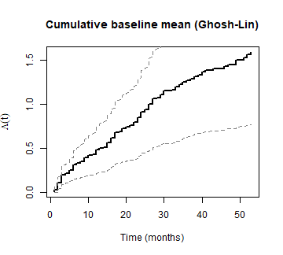
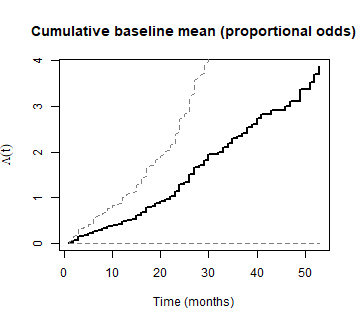
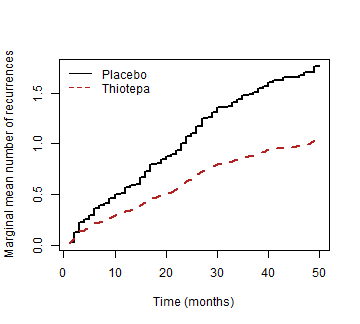

## Overview

The `wnpmle` package implements the **weighted nonparametric maximum likelihood
estimator (wNPMLE)** for the marginal mean of recurrent events in the presence
of a competing terminal event.

Competing events are commonly modeled as independent right-censorings, which
leads to overestimation of the marginal mean of a recurrent event. `wnpmle`
provides valid estimation and prediction via a weighted nonparametric maximum
likelihood estimation for two broad classes of semiparametric transformation
models.

| Models | Link function G(x) | Special case at param = 1 |
|-------|---------------------|---------------------------|
| Box-Cox transformation models (`model = "boxcox"`) | $((1 + x)^\rho - 1)/\rho$ | Ghosh–Lin ($\rho = 1$) |
| Logarithmic transformation models (`model = "log"`) | $\log(1 + r x)/r$ | Proportional odds ($r = 1$) |

Both are estimated via automatic differentiation using TMB, which provides
exact gradients and fast convergence.

---

## Installation


``` r
install.packages("wnpmle")
```

Or from GitHub:


``` r
# install.packages("remotes")
remotes::install_github("abellach/wnpmle")
```

---

## Quick start: bladder cancer data

The package ships with a pre-processed version of the `bladder` dataset from
the `survival` package, accessible via `bladder_prep()`.


``` r
library(wnpmle)

bdata       <- bladder_prep()
bdata_clean <- bdata[, c("id", "time", "status", "treat", "num", "size")]
head(bdata_clean)
#>   id time status treat num size
#> 1  1    0      2     0   1    1
#> 2  2    1      2     0   1    3
#> 3 18    1      1     0   8    1
#> 4 49    1      0     1   1    3
#> 5 50    1      2     1   1    1
#> 6 56    1      1     1   5    3
```

---

## Fitting the models

### Ghosh-Lin model (Box-Cox, rho = 1)


``` r
fit_bc <- wnpmle_fit(
  Surv(time, status) ~ treat + num + size,
  data  = bdata_clean,
  id    = "id",
  model = "boxcox",
  rho   = 1,
  tau   = 59,
  se    = "sandwich"
)
summary(fit_bc)
#> 
#> Weighted NPMLE - Recurrent Events with Competing Terminal Event
#> Type       : recurrent 
#> Model      : BOXCOX transformation (rho/r = 1 )
#> Subjects   : 86 
#> Events     : recurrent = 132   terminal = 22   censored = 64 
#> Log-lik    : -683.5759 
#> Convergence: relative convergence (4) 
#> 
#> Coefficients:
#>       Estimate     SE z value Pr(>|z|)
#> treat  -0.5363 0.2683  -1.999 0.045640
#> num     0.1727 0.0588   2.939 0.003288
#> size   -0.0051 0.0680  -0.074 0.940800
#> 
#> Cumulative baseline mean at time grid:
#>                 Lambda     SE
#> A(tau/4) = 14.8 0.5111 0.1442
#> A(tau/2) = 29.5 1.1076 0.2890
#> A(tau)   = 59   1.5882 0.4197
bl_bc <- baseline(fit_bc)
plot(bl_bc$time, bl_bc$Lambda, type = "s", lwd = 2,
     xlab = "Time (months)", ylab = expression(hat(Lambda)(t)),
     main = "Cumulative baseline mean (Ghosh-Lin)")
lines(bl_bc$time, bl_bc$lower, lty = 2, col = "grey50")
lines(bl_bc$time, bl_bc$upper, lty = 2, col = "grey50")
```



``` r
AIC(fit_bc)
#> [1] 1373.152
BIC(fit_bc)
#> [1] 1380.515
```

### Proportional odds model (logarithmic, r = 1)


``` r
fit_log <- wnpmle_fit(
  Surv(time, status) ~ treat + num + size,
  data  = bdata_clean,
  id    = "id",
  model = "log",
  rho   = 1,
  tau   = 59,
  se    = "sandwich"
)
summary(fit_log)
#> 
#> Weighted NPMLE - Recurrent Events with Competing Terminal Event
#> Type       : recurrent 
#> Model      : LOG transformation (rho/r = 1 )
#> Subjects   : 86 
#> Events     : recurrent = 132   terminal = 22   censored = 64 
#> Log-lik    : -685.6581 
#> Convergence: relative convergence (4) 
#> 
#> Coefficients:
#>       Estimate     SE z value Pr(>|z|)
#> treat  -0.9916 0.4587  -2.162 0.030620
#> num     0.3540 0.1339   2.645 0.008173
#> size    0.0140 0.1424   0.098 0.921700
#> 
#> Cumulative baseline mean at time grid:
#>                 Lambda     SE
#> A(tau/4) = 14.8 0.5328 0.2955
#> A(tau/2) = 29.5 1.8252 1.0548
#> A(tau)   = 59   3.8781 2.3702
bl_log <- baseline(fit_log)
plot(bl_log$time, bl_log$Lambda, type = "s", lwd = 2,
     xlab = "Time (months)", ylab = expression(hat(Lambda)(t)),
     main = "Cumulative baseline mean (proportional odds)")
lines(bl_log$time, bl_log$lower, lty = 2, col = "grey50")
lines(bl_log$time, bl_log$upper, lty = 2, col = "grey50")
```



``` r
AIC(fit_log)
#> [1] 1377.316
BIC(fit_log)
#> [1] 1384.679
```

---

## Prediction

`predict()` evaluates the estimated marginal mean at new covariate values.
Here we compare the mean number of recurrences over time for a treated
vs. placebo patient, holding the number of initial tumours and tumour size
fixed at 1.


``` r
newdat <- data.frame(treat = c(0, 1), num = c(1, 1), size = c(1, 1))

pred <- predict(fit_bc, newdata = newdat,
                times = seq(1, 50, by = 1))

plot(pred$time, pred$mu_1, type = "s", lwd = 2,
     xlab = "Time (months)", ylab = "Marginal mean number of recurrences",
     ylim = range(pred[, -1]))
lines(pred$time, pred$mu_2, lwd = 2, lty = 2, col = "firebrick")
legend("topleft", legend = c("Placebo", "Thiotepa"),
       lty = c(1, 2), col = c("black", "firebrick"), bty = "n")
```



---

## Choosing the transformation parameter

`plot_loglik()` sweeps over a grid of parameter values and plots the profile
log-likelihood for both models on a single axis. The logarithmic parameter r
is shown on the left (negative axis) and the Box-Cox parameter rho on the
right (positive axis), meeting at zero where the two models coincide.

The grids and the follow-up horizon tau are user-controlled. The function
fits `length(rho_grid) + length(r_grid)` models in total, so computation
time scales with grid size.


``` r
plot_loglik(
  Surv(time, status) ~ treat + num + size,
  data     = bdata_clean,
  id       = "id",
  tau      = 59,
  rho_grid = seq(0.01, 1.2, by = 0.01),
  r_grid   = seq(0.01, 1.2, by = 0.01)
)
```

The filled circle marks rho = 1 (Ghosh-Lin) and the open circle marks
r = 1 (proportional odds). The optimal parameter values are printed to the
console.

---

## Standard errors

The sandwich variance estimator accounts for the estimation of the inverse
probability of censoring weights. Set `se = "none"` to skip SE computation,
which is useful when profiling over a grid of transformation parameters.

| Value | Description |
|-------|-------------|
| `"sandwich"` | Sandwich variance estimator (default) |
| `"none"` | No standard errors, faster, useful for profiling |

---

## S3 methods

| Method | Description |
|--------|-------------|
| `print(fit)` | Compact coefficient table with z-values and p-values |
| `summary(fit)` | Adds cumulative baseline at tau/4, tau/2, tau |
| `coef(fit)` | Named coefficient vector |
| `vcov(fit)` | Full variance-covariance matrix for (beta, Lambda) |
| `logLik(fit)` | Log-likelihood (for use with AIC / BIC) |
| `AIC(fit)` | Akaike information criterion |
| `BIC(fit)` | Bayesian information criterion |
| `baseline(fit)` | Cumulative baseline mean data frame with CIs |
| `predict(fit, newdata)` | Marginal mean at new covariate values |

---

## Reference

For the methodology underlying this package, see Bellach A. and Kosorok M.R. (2026),
available at https://arxiv.org/abs/2605.25934.
